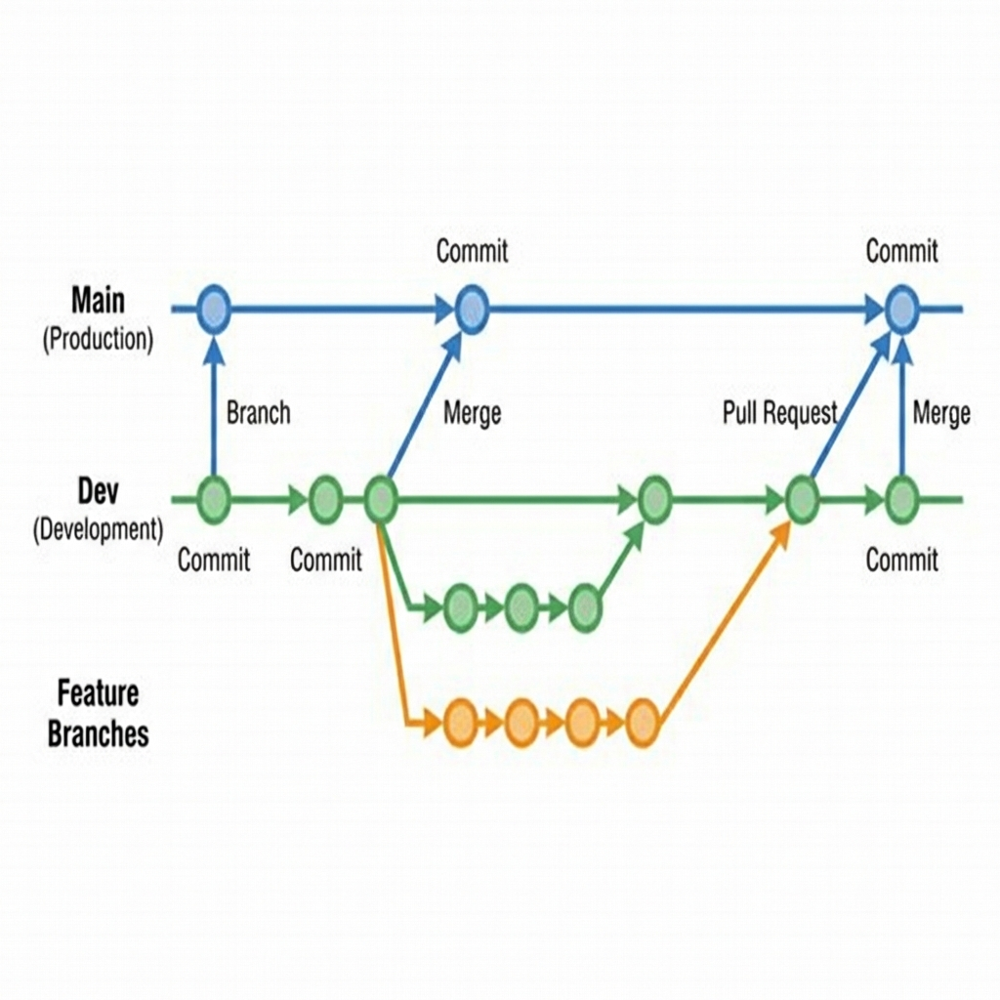

# Git Strategy

This project follows a simplified Git flow with a single production environment.

## Branches

- **main**: Production branch. Deployable code only.
- **dev**: Development branch. Integration point for features.
- **feature/***: Feature branches. Created from `dev`, merged back into `dev`.

## Workflow Diagram

## Rules

1. **Never commit directly to `main`**.
2. Create feature branches from `dev`: `git checkout -b feature/my-feature dev`.
3. Open a Pull Request (PR) to merge `feature/my-feature` into `dev`.
4. Once `dev` is stable and ready for release, merge `dev` into `main`.
